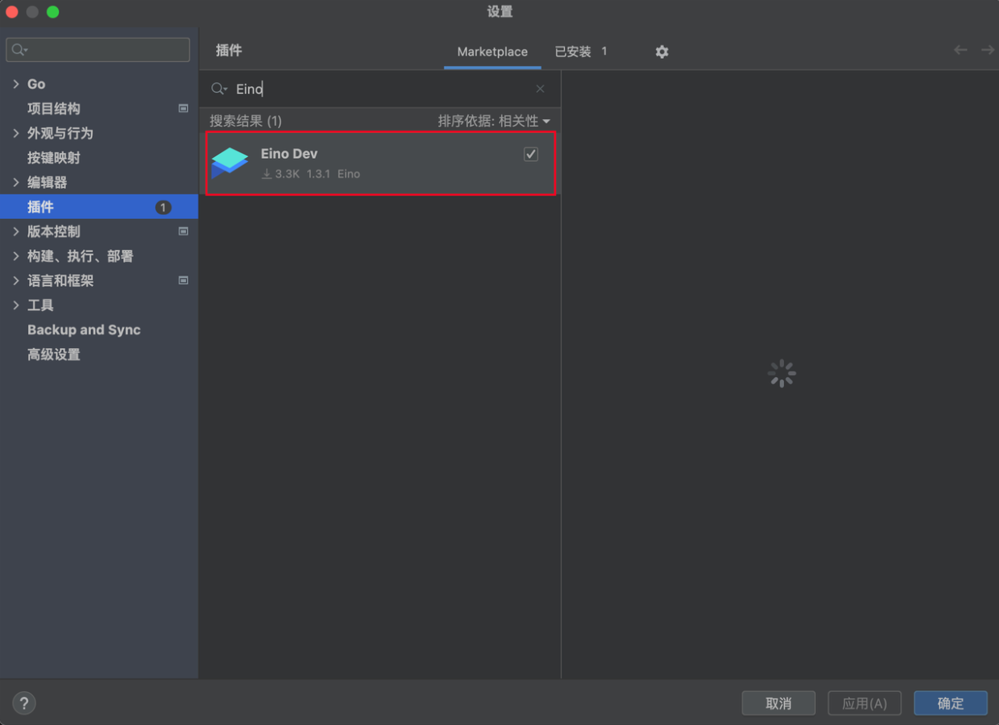
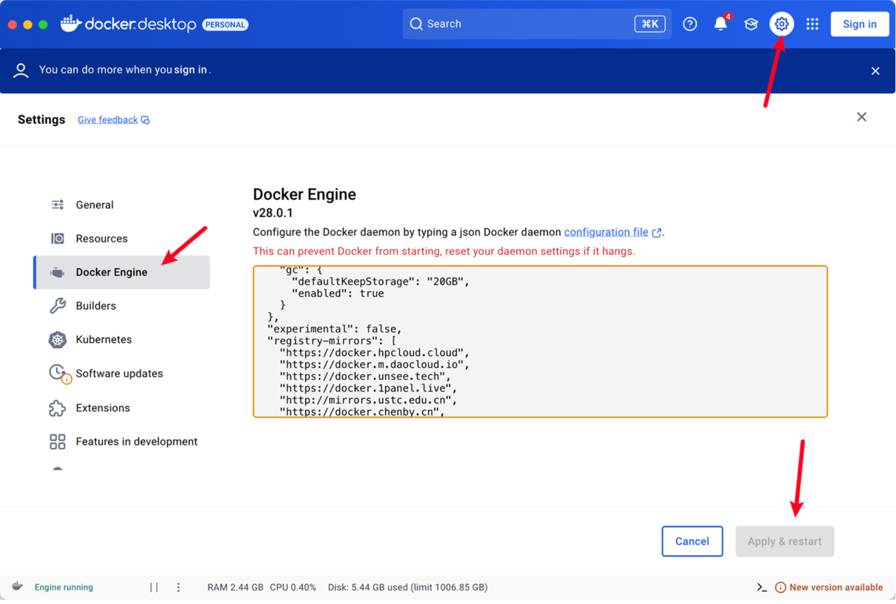
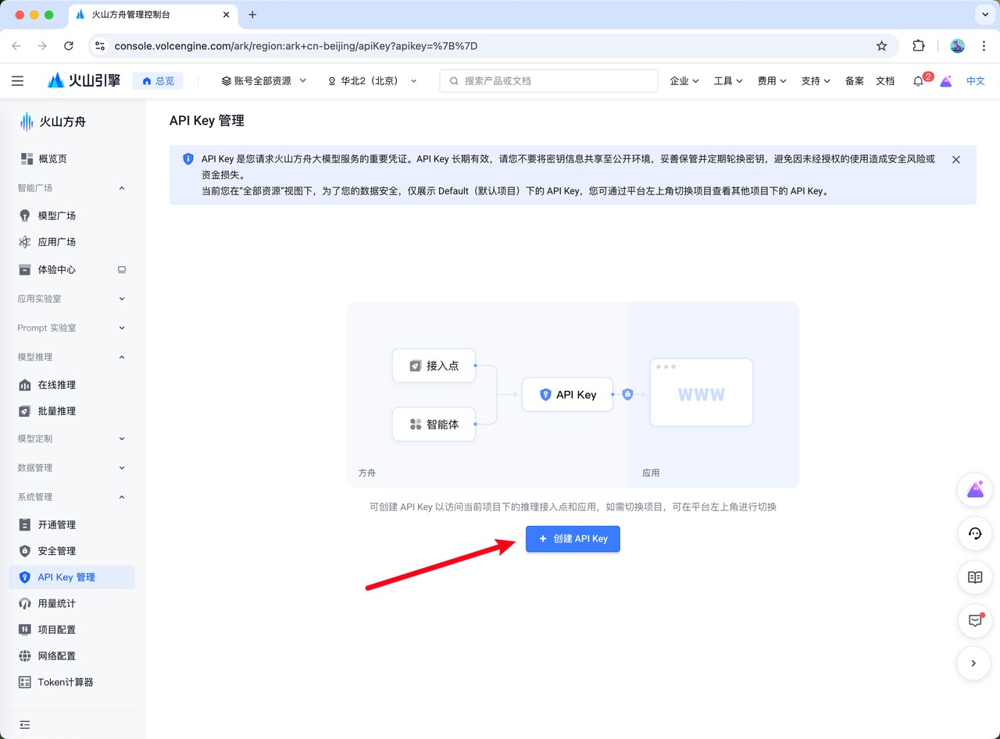
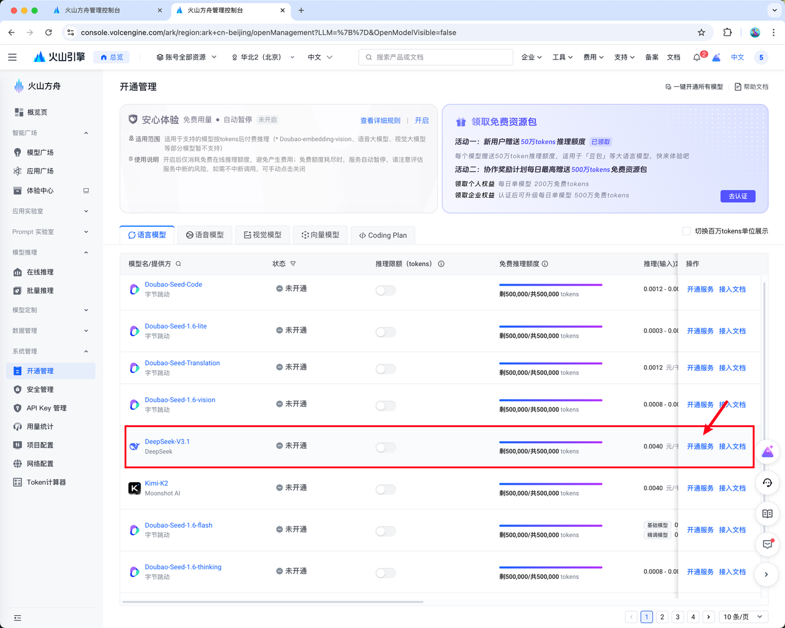
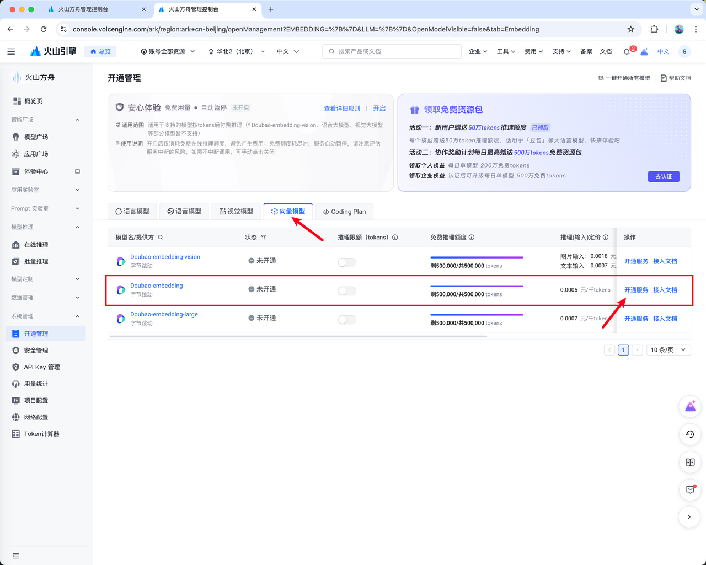
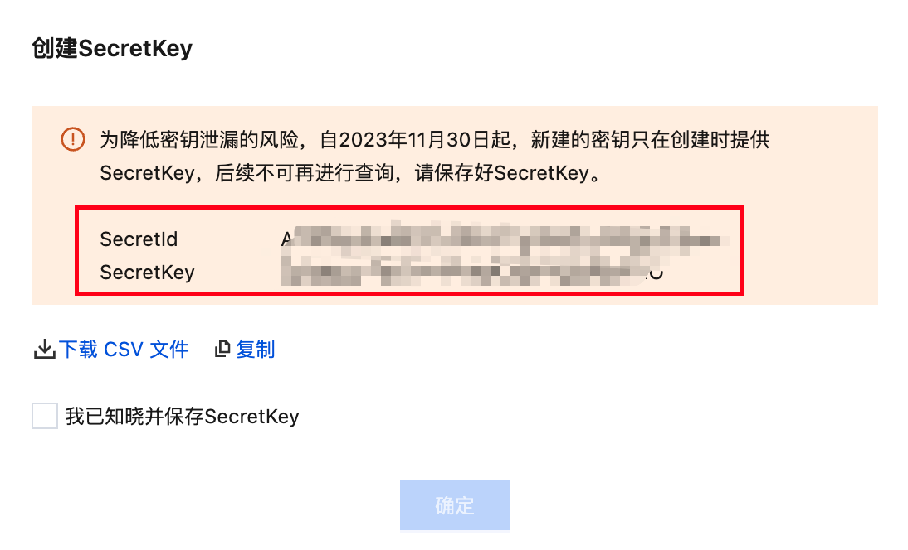
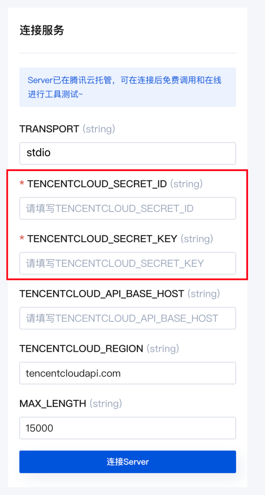
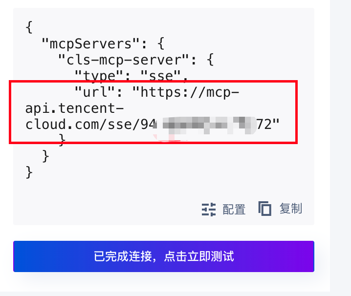
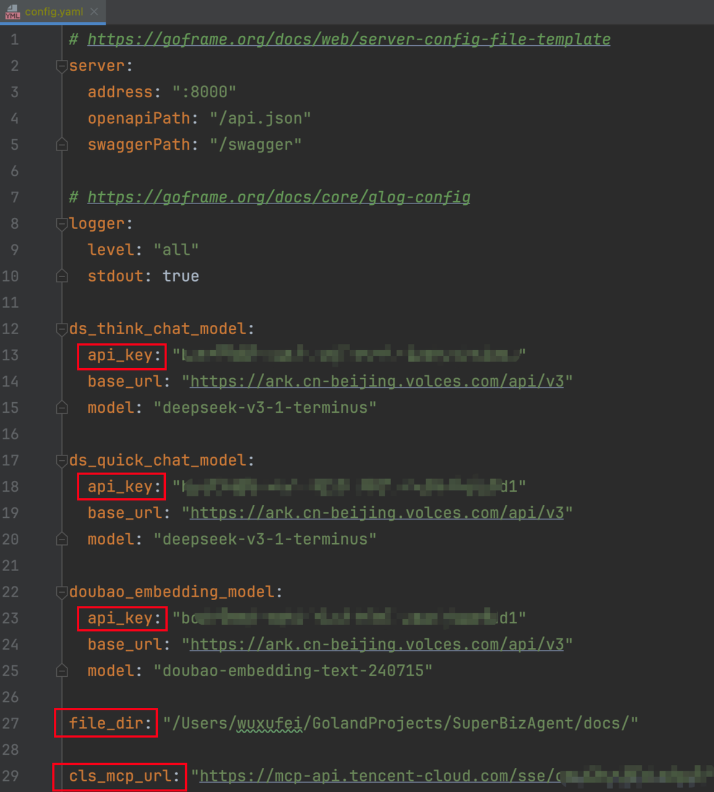
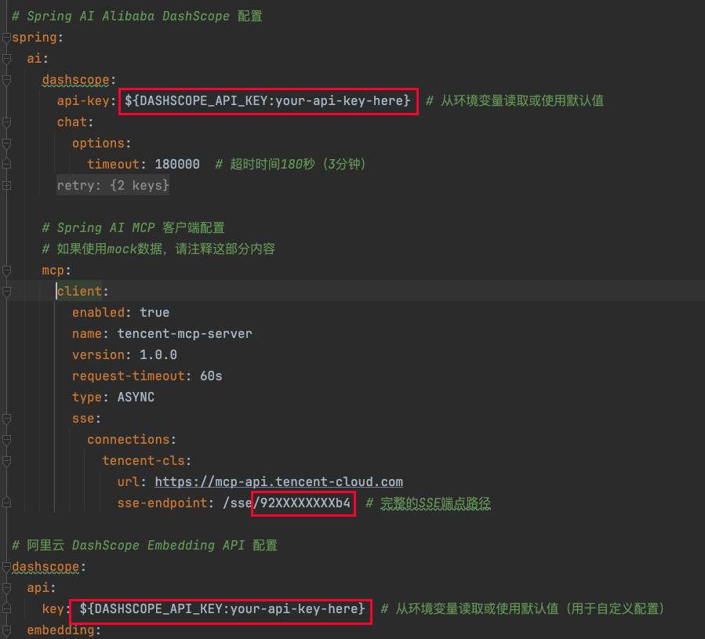

# 编辑器安装

## Go编辑器Goland安装

https://www.jetbrains.com/go/download/

进行官网按照你电脑的对应版本即可


## Goland Eino-Dev插件安装

进入设置->插件，搜索eino，安装这个Eino Dev



## Go 安装

Go安装： https://goframe.org/docs/install-go/index

Go module配置： https://goframe.org/docs/install-go/go-module


## Java编辑器IDEA安装

https://www.jetbrains.com/idea/download/

进行官网按照你电脑的对应版本即可


# docker安装

https://www.runoob.com/docker/windows-docker-install.html

根据你的电脑类型选择windows or mac安装即可



修改镜像源

```json
{
  "builder": {
    "gc": {
      "defaultKeepStorage": "20GB",
      "enabled": true
    }
  },
  "experimental": false,
  "registry-mirrors": [
    "https://docker.hpcloud.cloud",
    "https://docker.m.daocloud.io",
    "https://docker.unsee.tech",
    "https://docker.1panel.live",
    "http://mirrors.ustc.edu.cn",
    "https://docker.chenby.cn",
    "http://mirror.azure.cn",
    "https://dockerpull.org",
    "https://dockerhub.icu",
    "https://hub.rat.dev",
    "https://proxy.1panel.live",
    "https://docker.1panel.top",
    "https://docker.m.daocloud.io",
    "https://docker.1ms.run",
    "https://docker.ketches.cn"
  ]
}
```


# 大模型开通

## Go版本（默认用字节的大模型）

1. 字节跳动的火山云，新注册送50w token： https://console.volcengine.com/home

2. 注册好后，创建api key。这个api key需要你记住，等会要放到配置文件里面的： https://console.volcengine.com/ark/region:ark+cn-beijing/apiKey



3. 开通2个模型： https://console.volcengine.com/ark/region:ark+cn-beijing/openManagement

* 语言模型 -> DeepSeek-V3.1 开通



* 向量模型 -> Doubao-embedding 开通




## Java版本（默认用阿里的大模型）

1. 先登录阿里云，新注册也免费送token： https://bailian.console.aliyun.com/?tab=model#/model-market

2. 创建api key： https://bailian.console.aliyun.com/?tab=model#/api-key

3) 阿里云的模型不需要开启，可以直接使用，记住上面创建的密钥即可


# CLS MCP配置

1. 登陆腾讯云： https://console.cloud.tencent.com/

2. 创建密钥，secret id/key保存下来，后面要用： https://console.cloud.tencent.com/cam/capi




3. 进入腾讯云CLS MCP配置页面： https://cloud.tencent.com/developer/mcp/server/11710

4. 第一个填stdio，然后填刚才保存的 secret id 和 secret key，点击连接server



5. 保存返回给你的URL，后面要用

{
"mcpServers": {
"cls-mcp-server": {
"type": "sse",
"url": "https://mcp-api.tencent-cloud.com/sse/0f76a8e66076c78e"
}
}
}



# 项目配置

## Go版本

替换：

1. api\_key：如果你也用火山云，按照上述开通两个模型后，只需要替换下面的 api\_key 即可（所有模型共用同一个api key，不需要申请多个！）

2. file\_dir：用于存储用户上传的文档目录，自行选择一个目录即可

3) cls\_mcp\_url：mcp的地址，替换成上一步骤的url即可


路径： `SuperBizAgent/manifest/config/config.yaml`



## Java版本

替换：

1. 把红框里面替换成前面注册的阿里的api key

2. sse-endpoint替换成上面注册的mcp地址


路径： `SuperBizAgent/src/main/resources/application.yml`



